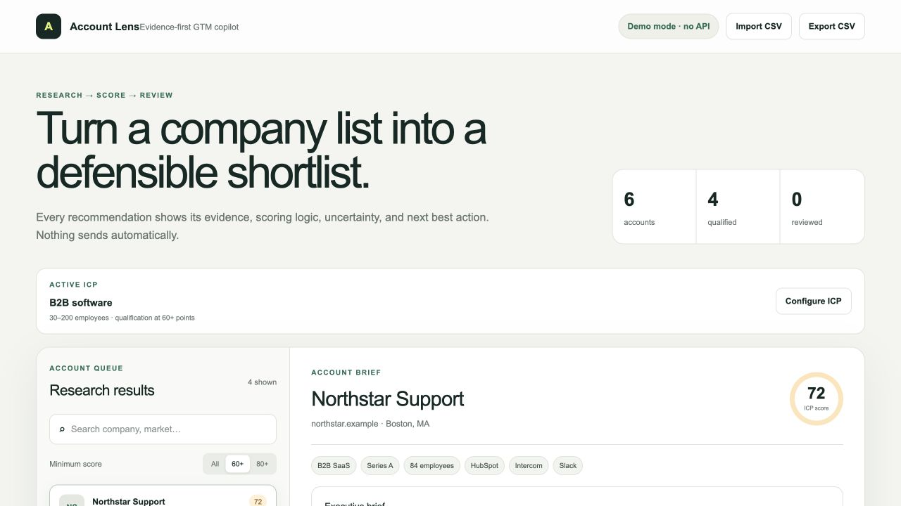

# Account Lens — Evidence-first GTM Copilot

Account Lens is a portfolio-grade prototype for B2B account research and qualification. It turns a company list into a reviewable shortlist without external APIs, contact scraping, or automated outreach.

**Live demo:** [lens.arturrakhimullin.com](https://lens.arturrakhimullin.com/)



## Why this exists

Sales research tools often produce plausible recommendations without showing why an account was selected. Account Lens keeps the decision inspectable:

- every score has a visible breakdown;
- evidence is separated from interpretation;
- unknowns and risk flags remain visible;
- drafts require a human review decision;
- nothing sends automatically.

## Demo workflow

1. Configure the employee range and market focus for the ICP.
2. Import a CSV or use the six fictional demo accounts.
3. Search or filter the account queue.
4. Inspect the account brief, evidence, and recommended angle.
5. Audit the score breakdown, including explicit risk penalties.
6. Approve or hold the account after human review.
7. Export decisions to CSV.

CSV imports require these columns: `name,domain,industry,employees,stage,location`. Imported rows are deliberately marked as unverified until a reviewer adds reliable evidence.

Try the workflow with [`examples/accounts.csv`](examples/accounts.csv). The file contains fictional companies and reserved `.example` domains.

## Architecture

```text
Fictional demo data or CSV import
              ↓
Schema validation and preview
              ↓
Configurable ICP rules
              ↓
Deterministic scoring + visible risk penalties
              ↓
Evidence-aware account brief
              ↓
Human Approve / Hold decision
              ↓
CSV export
```

The prototype is intentionally client-side. It does not persist uploaded data, call third-party enrichment services, or transmit outreach.

## ICP model

The deterministic demo score is capped at 100 points:

| Dimension | Maximum |
|---|---:|
| Company size | 20 |
| Market fit | 20 |
| Growth stage | 15 |
| GTM signals | 15 |
| Operational readiness | 6 |
| Evidence quality | 6 |
| Risk penalty | -5 per flag |

The score is intentionally simple and transparent. A production model would be calibrated against historical conversion data and reviewed for bias and data quality.

## Safety and data boundaries

- All companies, domains, signals, and source labels are fictional.
- The application uses no external API.
- It does not discover personal contact details.
- It does not send emails or enroll contacts in sequences.
- Review state lives only in the current browser session.

## Portfolio relevance

The project demonstrates ICP design, scoring logic, data modeling, evidence handling, uncertainty disclosure, workflow UX, human-in-the-loop review, CSV interoperability, and commercial systems thinking.

## Possible production extensions

- CRM import and write-back;
- real source citations with retrieval timestamps;
- evaluation dataset and scoring calibration;
- robust CSV validation and column mapping;
- role-based access and durable audit history.

## Local development

```bash
npm install
npm run dev
```

Build validation:

```bash
npm run build
```

Run the complete validation suite:

```bash
npm test
```

## Author

Built by [Artur Rakhimullin](https://www.linkedin.com/in/artur-rakhimullin/) as a GTM engineering portfolio project.
